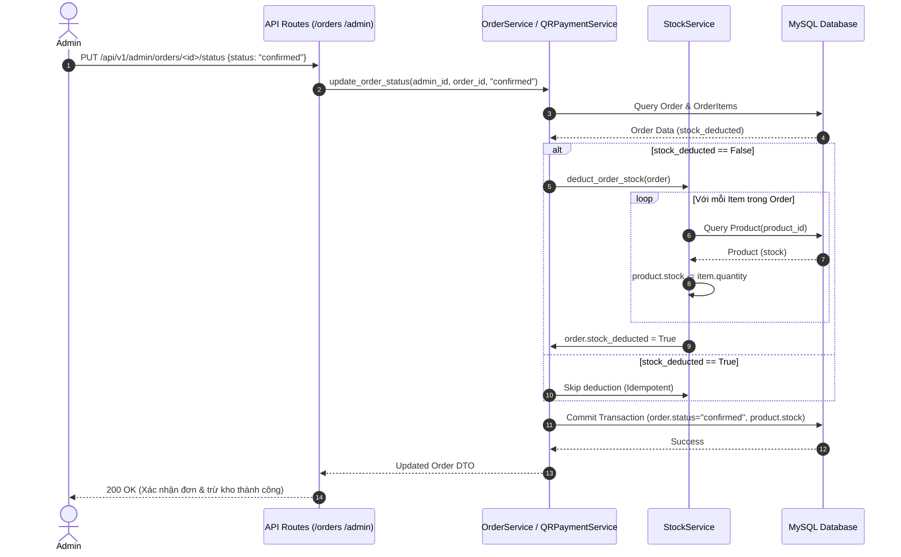
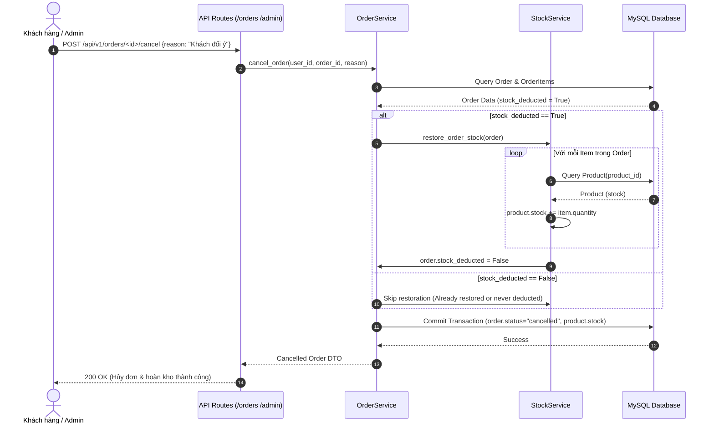

# Thiết kế luồng xử lý: NT-09-CN-002 — Trừ/Hoàn kho tự động theo trạng thái đơn hàng (QTN-03)

## 1. Sequence Diagram: Tự động trừ kho khi đơn hàng được xác nhận / thanh toán

---

## 2. Sequence Diagram: Tự động hoàn kho khi đơn hàng bị hủy

